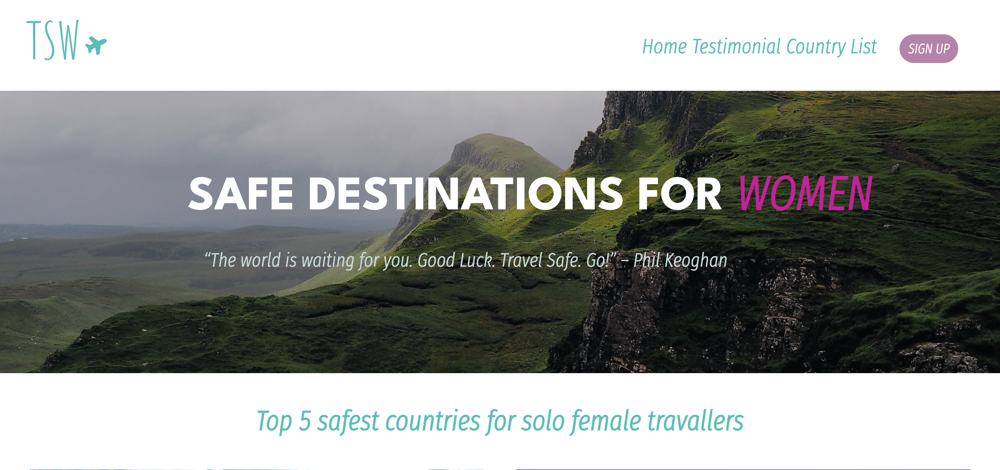

# [TSW - Travel Safety for Women](https://tsw.netlify.app/)

Project made for the second project of IronHack's Web Development Bootcamp São Paulo - Remote.

We use **ReactJS, HTML, CSS, JavaScript** and the libraries **Axios, ant design, material UI, and grommet**.

The website features the GeoSure ranking, which explains the safety of a particular country, and reasons why a country may be deemed unsafe. Additionally, it also includes comments from other women who have traveled to a specific country, providing real-life perspectives and experiences.

The website is built using ReactJS, HTML, CSS, JavaScript, and the libraries Axios, ant design, material UI, and grommet. 
We hope that this website serves as a valuable resource for women planning their next trip.

Made by [Caroline](https://github.com/carolineabreu), [Larissa](https://github.com/larissambn) and [Zimarlen](https://github.com/ZihSilva).
